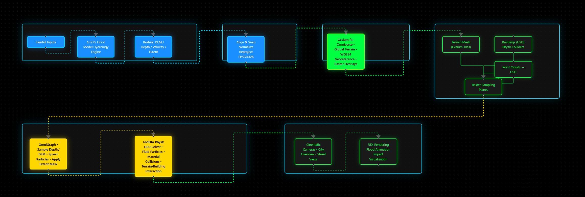

# **CivicSense - Urban Risk Intelligence Twin** 
## *Focus on Flood Risk of Proposed Buildings* 

## **1\. Overview**

CivicSense–FloodTwin is a **geospatially accurate, physics-driven Digital Twin** prototype that simulates urban flooding in Buellton, CA using:

* **ArcGIS Pro flood models** → water depth & velocity rasters  
* **Cesium for Omniverse** → Earth-scale geospatial context  
* **NVIDIA Omniverse** → USD-native environment  
* **PhysX GPU Fluid Particles** → interactive water–building collisions

The system demonstrates how a City Manager can **Observe, Orient, Decide, Act** about flood risk — supporting hazard awareness for proposed infrastructure.

## **2\. System Architecture**



## **3\. Features**

* **Raster-driven hydrodynamics**  
  * Flood depth controls particle spawn height and density  
  * Flood extent controls emitter masks  
  * Velocity raster optionally sets initial particle push vector  
* **PhysX fluid simulation**  
  * GPU-accelerated particles  
  * Material interaction against buildings and terrain  
  * Adjustable solver substeps, particle radius, friction  
* **Cesium geospatial precision**  
  * Terrain aligned with global coordinate frame  
  * Buildings dropped into accurate world coordinates  
* **Point Cloud → USD support**  
  * E57/LAS → USD conversion  
  * Used for urban details or to improve placement accuracy

## **4\. Repository Layout**
```
CivicSense-Flood/
├── README.md
├── LICENSE
├── .gitignore
├── docs/
│ ├── architecture/
│ ├── sprint/
│ ├── figures/
│ └── references/
├── data/
│ ├── samples/
│ ├── metadata/
│ └── README.md
├── omniverse/
│ ├── usd/
│ ├── scripts/
│ └── README.md
├── cesium/
├── arcgis/
└── notebooks/
```

## **5\. Installation & Requirements**

### **Software Versions**

* ArcGIS Pro 3.x  
* NVIDIA Omniverse USD Composer 2023+  
* Cesium for Omniverse Extension  
* Omniverse PhysX 5.x  
* Python 3.10+ (only for conversion scripts)

## **6\. Data Setup**

### **⚠️ Large Files Not Included**

This repo includes **sample rasters only**. Full export instructions are in `/arcgis/README.md`.

### **Download Instructions**

1. Run ArcGIS simulation  
2. Export:  
   * `DEM.tif`  
   * `Depth.tif`  
   * `Velocity.tif`  
   * `Extent.tif`  
3. Place under: /data/rasters\_local/2025-XX-XX/

## **7\. Running the Omniverse Scene**

### **Steps**

1. Open `omniverse/usd/base_scene.usda` in USD Composer  
2. Enable Cesium extension  
3. Load `cesium/ion/asset_manifest.json`  
4. Enable all buildings and point clouds  
5. Enable PhysX scene  
6. Play timeline; particles spawn based on raster sampling  
7. Use camera bookmarks to view:  
   * City overview  
   * PeaSoup  
   * Preschool

## **8\. OmniGraph: Raster → Particle Workflow**

Insert diagram from `/docs/architecture/raster_to_particles_flow.png`

### **Summary**

* Rasters converted to textures  
* OmniGraph samples UV and depth  
* Spawns particles where Depth \> threshold  
* Height \= DEM elevation \+ Depth  
* Velocity optional

## **9\. Sprint Plan**

Full sprint plan in: /docs/sprint/sprint\_plan.md  
Daily log templates in: /docs/sprint/daily\_logs/

## **10\. Limitations**

* Not a CFD model; PhysX fluids approximate shallow water  
* Performance constrained by particle count  
* Rasters must be preprocessed for identical resolution

## **11\. Next Steps - Toward a Full NVIDIA Earth-2 + Omniverse Workflow**

This prototype currently uses ArcGIS Pro for hydrology, Cesium for geospatial context, and Omniverse PhysX fluids for interactive visualization. A natural next phase is to migrate the hydrology and boundary conditions onto NVIDIA’s end-to-end AI + physics stack:

1. Integrate NVIDIA Earth-2 weather NIMs for boundary conditions  
   - Use Earth-2 APIs and NIM microservices (e.g., FourCastNet for global atmospheric dynamics and CorrDiff for km-scale downscaling) to generate ensembles of high-resolution rainfall scenarios over the Buellton basin, instead of hard-coded rainfall time series.  
   - Treat CivicSense-FloodTwin as a regional “node” that consumes Earth-2 forecasts and converts them into local runoff and inundation scenarios.  

2. Replace the raster hydrology solver with NVIDIA PhysicsNeMo (Modulus) flood models  
   - Use existing 2D/3D hydraulic simulations and observed events to train physics-ML models in NVIDIA PhysicsNeMo / Modulus that emulate the shallow-water solver for the Santa Ynez watershed.  
   - This follows the pattern of recent NVIDIA flood-modeling work where basin-scale inundation is learned as a surrogate model on the Earth-2 platform and then served for rapid what-if analysis.  
   - In this architecture, ArcGIS becomes primarily a data management and validation tool, while real-time prediction is handled by GPU-accelerated PhysicsNeMo models.

3. Adopt Earth-2 + Omniverse blueprints for city-scale analytics and visualization  
   - Use the Earth-2 Weather Analytics Blueprint and Omniverse real-time physics digital twin blueprints as reference implementations for:  
     - ingesting multi-layer geospatial data,  
     - serving AI weather and flood predictions via microservices, and  
     - streaming them into Omniverse as live USD layers for decision support dashboards.  
   - CivicSense-FloodTwin would then align with NVIDIA’s reference pipeline (CUDA-X libraries + PhysicsNeMo + NIM + Omniverse) for climate and flood resilience applications.

4. Extend the digital twin with AI agents and sensor fusion  
   - Add Metropolis/CV pipelines for CCTV and UAV video to detect blocked culverts, debris, or vehicles in real time, publishing those as dynamic obstacles into the Omniverse scene.  
   - Attach LLM-based NIM agents for Water Managers that can query the twin (“Which zones are over 0.5 m depth in the next 2 hours?”) and generate evacuation guidance and scenario comparisons.

5. Move toward continuous, operational deployment  
   - Package the PhysicsNeMo flood surrogate, Earth-2 rainfall NIM calls, and the Omniverse visualization pipeline into containerized microservices orchestrated on OVX or cloud GPUs.  
   - Run the system in “forecast mode” (consuming live weather feeds) and “training mode” (replaying historical storms) to support both research and operational resilience planning.
 
## **12\. License**

MIT License.
